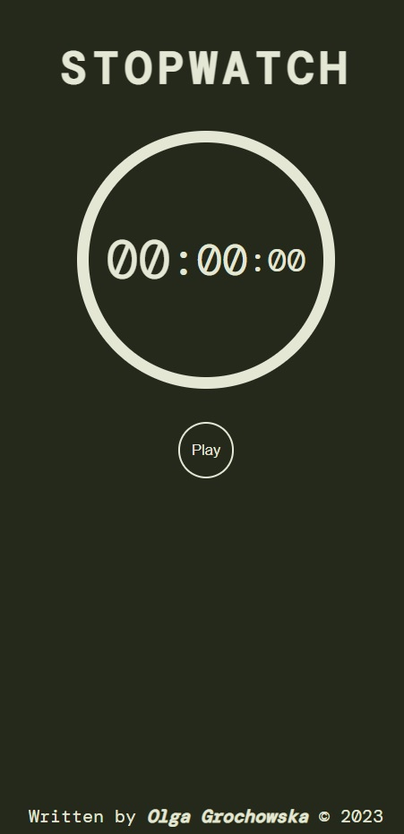
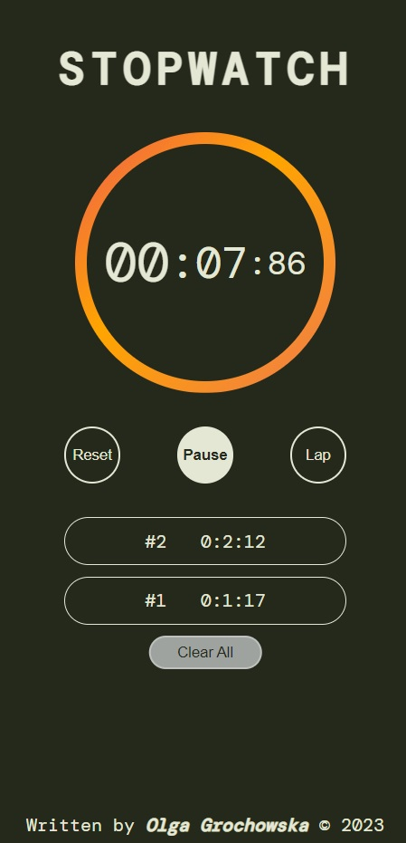

# Stopwatch

 

## Used Languages

---

 

## Description

---

This is a small project in which a stopwatch was built.

After starting the timer, there is an option to pause the time and add laps.

There is also implemented the possibility to reset the list of laps and the whole clock.

A video on the "Coding\_\_\_Bug" channel on Youtube inspired me to write my own version of a stopwatch.

 

## Design

---

 

